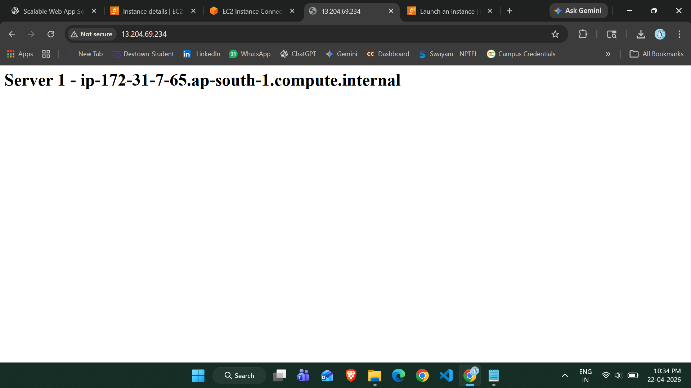
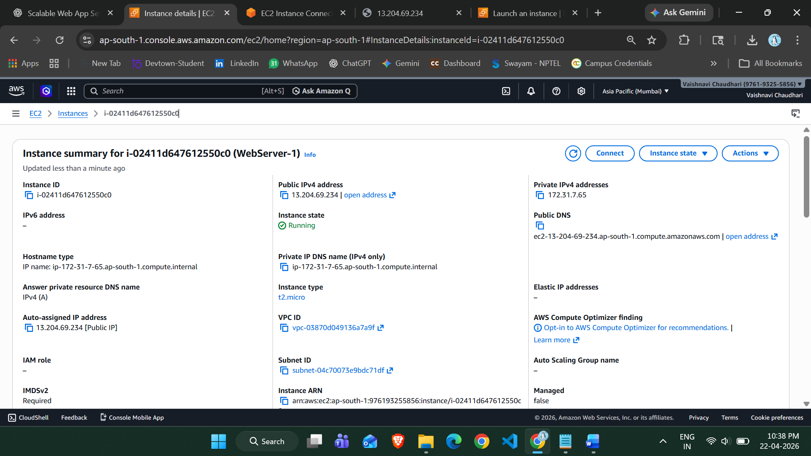
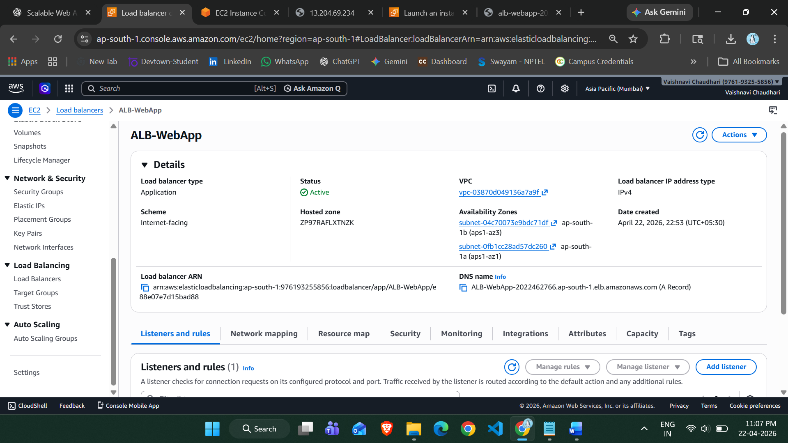
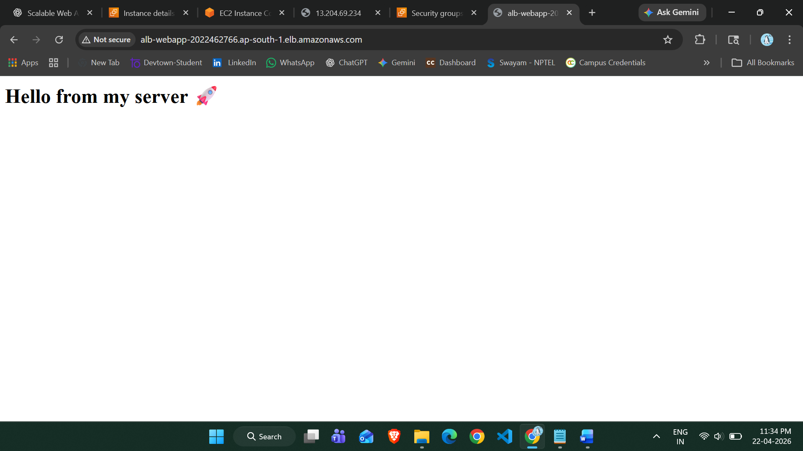

# 🚀 Scalable Web Application using AWS (ALB + Auto Scaling)

## 📌 Project Overview

This project demonstrates how to build a **highly scalable web application** on AWS using:

* Amazon EC2
* Application Load Balancer (ALB)
* Auto Scaling Group (ASG)
* Security Groups

The system automatically handles traffic and ensures high availability.

---

## 🎯 Objective

To design a system that:

* Handles high traffic
* Automatically scales instances
* Distributes load efficiently
* Avoids server crashes

---

## 🧰 AWS Services Used

| Service         | Purpose                       |
| --------------- | ----------------------------- |
| EC2             | Hosting web servers           |
| ALB             | Distribute traffic            |
| Auto Scaling    | Scale instances automatically |
| Security Groups | Control access                |

---

## 🏗️ Architecture

User → ALB → EC2 Instances (Auto Scaling)

---

## ⚙️ Step-by-Step Implementation

### 🔹 Step 1: Launch EC2 Instance

* Created an EC2 instance (Amazon Linux)
* Installed Apache Web Server

```bash
sudo yum update -y
sudo yum install -y httpd
sudo systemctl start httpd
sudo systemctl enable httpd
```

---

### 🔹 Step 2: Create Web Page

```bash
echo "<h1>Hello from my server 🚀</h1>" | sudo tee /var/www/html/index.html
```

---

### 🔹 Step 3: Create AMI

* Created AMI from configured EC2 instance
* This ensures all new instances have same setup

---

### 🔹 Step 4: Create Launch Template

* Selected created AMI
* Instance type: t2.micro
* Added security group (HTTP enabled)

---

### 🔹 Step 5: Create Target Group

* Type: Instances
* Protocol: HTTP (Port 80)
* Registered EC2 instance

---

### 🔹 Step 6: Create Application Load Balancer

* Type: Internet-facing
* Listener: HTTP (Port 80)
* Attached target group

---

### 🔹 Step 7: Create Auto Scaling Group

* Selected launch template
* Attached ALB
* Desired capacity: 2 instances
* Enabled scaling

---

## 🖼️ Project Screenshots

### 🔹 EC2 Instance Details



---

### 🔹 EC2 Direct Output (Before ALB)



---

### 🔹 Load Balancer Configuration



---

### 🔹 ⭐ Final Output (ALB Working)



---

## 🎉 Final Result

* Load balancer successfully distributes traffic
* Multiple instances handle requests
* Web page displays:

```
Hello from my server 🚀
```

* Refreshing the page routes request across instances

---

## 💡 Key Learnings

* How ALB works in real-world applications
* Importance of Auto Scaling
* High availability architecture
* AWS networking basics

---

## 🚀 Future Improvements

* Add HTTPS (SSL Certificate)
* Deploy using Docker & ECS
* Add monitoring (CloudWatch)
* CI/CD integration

---

## 👩‍💻 Author

**Disha**
AWS + Python Enthusiast 🚀
